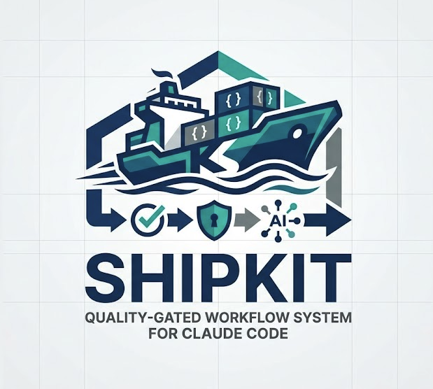

<div align="center">



# SHIPKIT

**A structured, quality-gated workflow system for Claude Code.**

Ship features with TDD, security audits, and AI-powered code review —<br>
all wired into a single repeatable workflow.

[](https://www.npmjs.com/package/@kennethsolomon/shipkit)
[](LICENSE)
[](#)

```bash
npm install -g @kennethsolomon/shipkit && shipkit
```

</div>

---

## What is ShipKit?

ShipKit turns Claude Code into a disciplined development partner. Instead of "write some code and hope," every task follows a structured path:

**Plan → Build (TDD) → Quality Gates → Ship**

Each gate must pass before the next step. Lint fails? Fix it. Tests don't cover new code? Write them. Security issues? They block the PR. Quality is structural, not optional.

ShipKit auto-detects your stack — linters, test runners, frameworks, ORMs. No configuration needed.

---

## Quick Start

```bash
# 1. Install
npm install -g @kennethsolomon/shipkit && shipkit

# 2. Bootstrap your project (run once per project)
/sk:setup-claude

# 3. Start any task
/sk:start add user authentication
```

`/sk:setup-claude` creates everything your project needs: planning files, lifecycle hooks, 13 agent definitions, path-scoped rules, LSP config, and MCP servers.

`/sk:start` is your single entry point — tell it what you want to do in plain English and it classifies the task, picks the right flow, and routes you automatically.

To update ShipKit later:
```bash
npm install -g @kennethsolomon/shipkit && shipkit  # update globally
/sk:setup-optimizer                                 # update each project
```

---

## Which scenario are you in?

| I want to... | Start here | Flow |
|---|---|---|
| **Not sure — just describe my task** | `/sk:start <description>` | Auto-classified |
| **Build a new feature** | `/sk:start add <feature>` | Feature (8 phases + scope check, learn, retro) |
| **Build a full-stack feature (backend + frontend + mobile)** | `/sk:start --team add <feature>` | Feature with parallel agents |
| **Make a small change** (config, copy, dependency bump) | `/sk:start bump lodash` | Fast-track (5 steps) |
| **Fix a bug** | `/sk:start fix <description>` | Debug (7 steps) |
| **Fix a production emergency** | `/sk:start hotfix <description>` | Hotfix (6 steps) |
| **Requirement changed mid-way** | `/sk:change` | Re-enter at the right step |
| **Understand an unfamiliar codebase** | `/sk:reverse-doc architecture src/` | Generate architecture docs |
| **Set up CI/CD** | `/sk:ci` | GitHub Actions or GitLab CI |
| **Clean up messy code** | Use `refactor-specialist` agent | Behavior-preserving refactor |
| **Generate missing docs** | Use `tech-writer` agent | README, API, architecture docs |

---

## Scenario Tutorials

### Scenario A — Building a New Feature

You want to add user authentication to your app.

```
/sk:start add email/password authentication with JWT
```

ShipKit classifies this as a **full-stack feature** and confirms:

```
Detected: Full-stack feature
Flow:   feature (8 steps)
Mode:   autopilot
Agents: team (backend + frontend + QA)

Proceed? (y)
```

Type `y`. Here's what happens automatically:

**Step 1 — Brainstorm** (`/sk:brainstorming`)
Reads your `tasks/findings.md` and `tasks/lessons.md`. Asks clarifying questions one at a time: session vs token auth? remember me? email verification? Writes decisions to `tasks/findings.md`.

For complex architecture decisions, the `architect` agent kicks in before you write a plan:
> Reads your codebase → proposes 2-3 approaches with trade-offs → outputs: "Use Laravel Sanctum (already in composer.json) — not Passport"

**Step 2 — Design**
- `architect` agent produces API contracts: `POST /auth/login`, `POST /auth/register`, etc.
- `/sk:frontend-design` produces login/register page mockups.
- `database-architect` agent reviews the proposed schema: flags missing index on `users.email`, recommends nullable `email_verified_at`.

**Step 3 — Plan** (`/sk:write-plan`)
Writes `tasks/todo.md` with every checkbox: migrations, models, controllers, frontend pages, tests.

**Step 4 — Branch**
```
git checkout -b feature/add-authentication
```

**Step 5 — Implement** (`/sk:team`)
Three agents fire simultaneously:

```
backend-dev  (worktree)   → writes AuthTest.php → implements migration, User model, AuthController
frontend-dev (worktree)   → writes LoginPage.test.ts → implements LoginPage, useAuth composable
qa-engineer  (background) → writes 14 Playwright E2E scenarios while others implement
```

Backend and frontend work in isolated worktrees — zero conflicts. Results merge when both complete.

**Step 5.5 — Scope Check** (`/sk:scope-check`)
Compares everything that was implemented against `tasks/todo.md`. Flags anything that crept in beyond the plan — extra features, unrequested refactors, new files not in scope. Trims or defers the excess before committing.

**Step 6 — Commit** (`/sk:smart-commit`)
Presents the diff. You approve. Commits.

**Step 7 — Gates** (`/sk:gates`)
Four batches run:

```
Batch 1 (parallel):
  security-reviewer  → OWASP audit → flags: no rate limit on POST /login
  performance-optimizer → scans for N+1 → clean
  linter             → pint auto-fixes formatting

Batch 2:
  test runner        → 97% coverage → adds missing test → 100%

Batch 3:
  code-reviewer      → 7-dimension review → flags: logout doesn't revoke all tokens

Batch 4:
  E2E tester         → runs 14 Playwright scenarios → 14/14 pass
```

Each failure auto-fixes and re-runs. One squash commit per gate pass.

**Step 8 — Finalize** (`/sk:finish-feature`)
Changelog updated. PR created. Feature spec synced. Asks about release.

**Step 8.5 — Learn** (`/sk:learn`)
Extracts reusable patterns from this session:
> "Rate limiting must be applied to all auth endpoints — security-reviewer flagged POST /login"

Saved to `~/.claude/skills/learned/` — available in future sessions across all projects.

**Step 8.6 — Retro** (`/sk:retro`)
Brief post-ship retrospective — 3-5 bullets:
- What went well (gates caught rate-limit issue before PR)
- What slowed down (schema index discovery required re-migration)
- Next action (add rate-limit check to write-tests template)

---

### Scenario B — Fixing a Bug

Checkout total is wrong when a coupon and tax are both applied.

```
/sk:start fix checkout total wrong when coupon and tax applied
```

ShipKit detects `fix` keyword → routes to **debug flow**.

The `debugger` agent takes over:
1. Reproduces: `POST /checkout` with `SAVE20` + CA tax → wrong total
2. Isolates: `OrderCalculator::applyDiscount()` runs before `TaxService::calculate()`
3. Hypothesis: discount should apply to subtotal, tax should compute on the discounted subtotal
4. Verifies: writes a failing unit test proving expected vs actual
5. Proposes minimal fix in `OrderCalculator.php:47`

You approve → fix applied → regression test committed → `/sk:gates` → PR.

After merge, `/sk:learn` captures:
> "Calculation order matters in pricing pipeline — always test discount + tax combinations together"

---

### Scenario C — Production Hotfix

Login is broken in production (500 error). It's 2am.

```
/sk:start hotfix login 500 error in production
```

ShipKit detects `hotfix` + `production` → routes to **hotfix flow** (no TDD ceremony, gates still enforced).

```
/sk:debug    → reads Sentry trace → undefined method 'getAuthToken' on User model
/sk:branch   → hotfix/login-500-missing-auth-token
```

Fix applied directly — no brainstorm, no write-tests. Then:

```
/sk:gates    → all gates pass
/sk:finish-feature → PR marked as hotfix
```

After merge: add regression test + lesson to `tasks/lessons.md`. Never skip this step.

---

### Scenario D — Small Change

Bump lodash to the latest version.

```
/sk:start bump lodash dependency to latest
```

ShipKit detects `bump` + `dependency` → routes to **fast-track flow** (5 steps, no planning ceremony).

```
/sk:branch   → fast-track/bump-lodash
update package.json
/sk:smart-commit
/sk:gates    → same gates, no shortcuts on quality
/sk:finish-feature
```

Guard rails: warns if the diff exceeds 300 lines (should be a full workflow at that point).

---

### Scenario E — Requirement Changed Mid-Way

You're implementing a payment feature and the stakeholder adds "also support PayPal" after the plan is already written.

```
/sk:change
```

ShipKit classifies the scope change:

| Tier | What it means | Example |
|---|---|---|
| **Tier 1** | Behavior tweak, same scope | "Delete all" → "Delete users only" → re-enter at Write Tests |
| **Tier 2** | New requirements added | "Also add PayPal support" → re-enter at Write Plan |
| **Tier 3** | Scope shift, rethink needed | "Different approach entirely" → re-enter at Brainstorm |

PayPal support = Tier 2. ShipKit revises the plan and re-enters at Step 3.

---

## The 13 Agents

Agents are specialized sub-agents deployed to `.claude/agents/` by `/sk:setup-claude`. They are **explicitly invoked** by the workflow skills — not guessed. Each has its own memory, model, and isolation settings.

### Implementation Agents — build things

| Agent | Invoked by | What it does |
|---|---|---|
| `backend-dev` | `sk:team` Step 2 | Writes backend tests (TDD red) then implements API, services, models in a worktree |
| `frontend-dev` | `sk:team` Step 2 | Writes frontend tests then implements components, pages, composables in a worktree |
| `mobile-dev` | `sk:team` Step 2 (mobile scope) | React Native / Expo / Flutter — mobile patterns, permissions, store prep |

### Quality Agents — find and fix problems

| Agent | Invoked by | What it does |
|---|---|---|
| `qa-engineer` | `sk:team` Step 2 | Writes E2E scenarios while others implement (background — doesn't block) |
| `code-reviewer` | `sk:gates` Batch 3 | 7-dimension review: correctness, security, performance, reliability, design, best practices, testing (read-only) |
| `security-reviewer` | `sk:gates` Batch 1, `sk:security-check` | OWASP audit — memory: user (remembers security patterns across all your projects) (read-only) |
| `performance-optimizer` | `sk:gates` Batch 1, `sk:perf` | Finds AND fixes Critical/High perf issues in a worktree |

### Design Agents — plan before building

| Agent | Invoked by | What it does |
|---|---|---|
| `architect` | `sk:brainstorming` (complex tasks) | Proposes 2-3 architectural approaches with trade-offs before `/sk:write-plan` (read-only) |
| `database-architect` | `sk:schema-migrate` Phase 0 | Migration safety analysis, index recommendations, breaking change flags (read-only) |

### Operations Agents — infrastructure and maintenance

| Agent | Invoked by | What it does |
|---|---|---|
| `devops-engineer` | `sk:ci` | Generates CI/CD workflow files in a worktree — GitHub Actions, GitLab CI, Docker |
| `debugger` | `sk:debug` | Structured root-cause analysis: reproduce → isolate → hypothesize → verify → fix |
| `refactor-specialist` | On demand | Behavior-preserving cleanups — runs tests before AND after every change |
| `tech-writer` | `sk:reverse-doc` Phase 3 | README, API docs, architecture docs — reads code first, never invents behavior |

**Key rule:** Read-only agents (`security-reviewer`, `code-reviewer`, `architect`, `database-architect`) report findings — the main context or a write agent applies fixes. Write agents (`performance-optimizer`, `backend-dev`, `devops-engineer`, etc.) make changes directly in a worktree.

---

## Quality Gates

`/sk:gates` runs all 6 gates in optimized parallel batches. One command replaces six.

| Batch | Gates | Notes |
|---|---|---|
| **1** (parallel) | lint + `security-reviewer` + `performance-optimizer` | Independent — run simultaneously |
| **2** | tests (100% coverage on new code) | Needs lint fixes first |
| **3** | `code-reviewer` (7-dimension) | Needs test confirmation |
| **4** | E2E (Playwright or agent-browser) | Uses scenarios from `qa-engineer` |

Each gate auto-fixes and re-runs until clean. One squash commit per gate pass. If a gate fails 3 times it stops and asks for help. Pre-existing issues are logged to `tasks/tech-debt.md` — never fixed inline.

---

## Lifecycle Hooks

Installed by `/sk:setup-claude`. Fire automatically on Claude Code events.

**Always installed:**

| Hook | When | What it does |
|---|---|---|
| `session-start` | Session opens | Loads branch, recent commits, active task, tech debt |
| `session-stop` | Session closes | Logs accomplishments to `tasks/progress.md` |
| `pre-compact` | Before context compression | Saves git state |
| `validate-commit` | Before `git commit` | Validates conventional commit format, detects secrets |
| `validate-push` | Before `git push` | Warns before pushing to protected branches |
| `log-agent` | Sub-agent starts | Logs invocations to `tasks/agent-audit.log` |

**Opt-in:**

| Hook | What it does |
|---|---|
| `post-edit-format` | Auto-formats with Biome/Prettier/Pint/gofmt after every edit |
| `config-protection` | Blocks edits to linter/formatter config files |
| `console-log-warning` | Warns about `console.log`, `dd()`, `var_dump()` in modified files |
| `cost-tracker` | Logs session metadata to `.claude/sessions/cost-log.jsonl` |
| `safety-guard` | Enforces `/sk:safety-guard` freeze/careful mode |

---

## Path-Scoped Rules

Rule files in `.claude/rules/` auto-activate in Claude Code when you edit matching files — no manual context loading.

| Rule file | Activates when editing | Enforces |
|---|---|---|
| `laravel.md` | `app/**/*.php`, `routes/**`, `config/**` | Laravel conventions, Eloquent patterns |
| `react.md` | `**/*.tsx`, `**/*.jsx` | Hooks rules, component patterns, TypeScript strictness |
| `vue.md` | `**/*.vue`, `resources/js/**` | Composition API only, `<script setup>`, Pinia |
| `tests.md` | `tests/**`, `**/*.test.*`, `**/*.spec.*` | TDD standards, assertion quality, test isolation |
| `api.md` | `routes/api.php`, `app/Http/Controllers/**` | RESTful conventions, auth patterns, error shapes |
| `migrations.md` | `database/migrations/**`, `prisma/**` | Migration safety, reversibility, index naming |

---

## MCP Servers

Installed optionally by `/sk:setup-claude` and `/sk:setup-optimizer`.

| Server | What it does | Best for |
|---|---|---|
| **Sequential Thinking** | Structured reasoning scratchpad — Claude thinks through hard problems step-by-step without cluttering the conversation | `/sk:brainstorm`, `/sk:debug`, `/sk:review` |
| **Context7** | Fetches current, version-accurate docs for libraries you're using — no stale API suggestions | React 19, Next.js 15, Tailwind v4, shadcn/ui |
| **ccstatusline** | Persistent statusline: context window %, model, git branch, current task | Every session |

---

## On-Demand Tools

Use these anytime outside of the main workflow.

### Intelligence

| Command | Usage | What it does |
|---|---|---|
| `/sk:learn` | `/sk:learn` | Extract reusable patterns from the session with confidence scoring (0.3–0.9) |
| `/sk:learn` | `/sk:learn --list` | Show all learned patterns |
| `/sk:eval` | `/sk:eval define auth` | Define eval criteria before coding |
| `/sk:eval` | `/sk:eval check auth` | Run evals during implementation |
| `/sk:health` | `/sk:health` | Scorecard across 7 categories (0–70) |
| `/sk:context-budget` | `/sk:context-budget` | Audit token consumption across skills, agents, CLAUDE.md |

### Session Management

| Command | Usage | What it does |
|---|---|---|
| `/sk:save-session` | `/sk:save-session` | Save branch, task, progress to `.claude/sessions/` |
| `/sk:resume-session` | `/sk:resume-session --latest` | Restore most recent session |
| `/sk:context` | `/sk:context` | Load all project context (automatic via hooks) |

### Safety

| Command | Usage | What it does |
|---|---|---|
| `/sk:safety-guard` | `careful` | Block destructive commands |
| `/sk:safety-guard` | `freeze --dir src/` | Lock edits to a directory |
| `/sk:safety-guard` | `off` | Disable all guards |

### Code Quality

| Command | When to use |
|---|---|
| `/sk:scope-check` | Mid-implementation — detect scope creep |
| `/sk:retro` | After shipping — velocity, blockers, action items |
| `/sk:seo-audit` | Web projects — SEO audit against source + dev server |

### Setup & Docs

| Command | When to use |
|---|---|
| `/sk:reverse-doc` | New to a codebase — generate architecture/design/API docs from existing code |
| `/sk:setup-optimizer` | Monthly — update CLAUDE.md, deploy missing agents, hooks, rules |
| `/sk:ci` | Once per repo — GitHub Actions or GitLab CI with PR review + nightly audits |
| `/sk:plugin` | Distribute — package custom skills/agents/hooks as a shareable Claude Code plugin |
| `/sk:mvp` | New idea — generate a complete MVP app from a single prompt |
| `/sk:website` | Client work — build a full multi-page marketing site from a brief or URL |

---

## Stack Support

| Area | Supported |
|---|---|
| **Frameworks** | Laravel, Next.js, Nuxt, React, Vue, Node.js |
| **Linters** | Pint, ESLint, PHPStan, Rector, Prettier, Biome |
| **Test runners** | Pest, PHPUnit, Jest, Vitest, Playwright |
| **Schema / ORM** | Prisma, Drizzle, Eloquent, SQLAlchemy, ActiveRecord |
| **Release** | npm, Composer, iOS (App Store), Android (Play Store) |

---

## All Commands

<details>
<summary><strong>43 skills + 13 agents</strong> — click to expand</summary>

| Command | Purpose |
|---|---|
| `/sk:accessibility` | WCAG 2.1 AA audit |
| `/sk:api-design` | Design API contracts before implementation |
| `/sk:autopilot` | Hands-free workflow — auto-skip, auto-advance, auto-commit |
| `/sk:brainstorm` | Explore requirements and design |
| `/sk:branch` | Create feature branch from current task |
| `/sk:change` | Handle mid-workflow requirement changes |
| `/sk:ci` | Set up GitHub Actions / GitLab CI |
| `/sk:config` | View/edit project config |
| `/sk:context` | Load project context |
| `/sk:context-budget` | Audit context window token consumption |
| `/sk:dashboard` | Live Kanban board across worktrees |
| `/sk:debug` | Structured bug investigation |
| `/sk:e2e` | E2E behavioral verification |
| `/sk:eval` | Define, run, and report evals |
| `/sk:execute-plan` | Execute plan checkboxes in batches |
| `/sk:fast-track` | Small changes — skip planning, keep gates |
| `/sk:features` | Sync feature specs with codebase |
| `/sk:finish-feature` | Changelog + PR |
| `/sk:frontend-design` | UI mockup + optional Pencil visual design |
| `/sk:gates` | All quality gates in parallel batches |
| `/sk:health` | Harness self-audit scorecard |
| `/sk:help` | Show all commands |
| `/sk:hotfix` | Emergency fix workflow |
| `/sk:laravel-init` | Configure existing Laravel project |
| `/sk:laravel-new` | Scaffold fresh Laravel app |
| `/sk:learn` | Extract reusable patterns from sessions |
| `/sk:lint` | Auto-detect and run all linters |
| `/sk:mvp` | Generate MVP app from a prompt |
| `/sk:perf` | Performance audit |
| `/sk:plan` | Create/refresh planning files |
| `/sk:plugin` | Package skills/agents/hooks as a plugin |
| `/sk:release` | Version bump + tag (`--android` / `--ios` for store audit) |
| `/sk:resume-session` | Resume a previously saved session |
| `/sk:retro` | Post-ship retrospective |
| `/sk:reverse-doc` | Generate docs from existing code |
| `/sk:review` | 7-dimension code review |
| `/sk:safety-guard` | Protect against destructive ops |
| `/sk:save-session` | Save session state for continuity |
| `/sk:schema-migrate` | Database schema change analysis |
| `/sk:scope-check` | Detect scope creep mid-implementation |
| `/sk:security-check` | OWASP security audit with CVSS scoring |
| `/sk:seo-audit` | SEO audit for web projects |
| `/sk:set-profile` | Switch model routing profile |
| `/sk:setup-claude` | Bootstrap project scaffolding |
| `/sk:setup-optimizer` | Update workflow, agents, hooks, CLAUDE.md |
| `/sk:skill-creator` | Create or improve skills |
| `/sk:smart-commit` | Conventional commit with approval |
| `/sk:start` | Smart entry point — classifies task, routes to flow |
| `/sk:status` | Show workflow + task status |
| `/sk:team` | Parallel domain agents for full-stack tasks |
| `/sk:test` | Run all test suites |
| `/sk:update-task` | Mark task done |
| `/sk:website` | Build a full multi-page marketing site |
| `/sk:write-plan` | Write plan to `tasks/todo.md` |
| `/sk:write-tests` | TDD: write failing tests first |

</details>

---

## Learn More

| Topic | Where |
|---|---|
| Detailed 8-step workflow | [DOCUMENTATION.md](.claude/docs/DOCUMENTATION.md) |
| Feature specifications | [docs/FEATURES.md](docs/FEATURES.md) |
| Model routing profiles & config | [DOCUMENTATION.md — Config](.claude/docs/DOCUMENTATION.md#config-reference) |
| Infrastructure (hooks, agents, rules) | [DOCUMENTATION.md — Setup](.claude/docs/DOCUMENTATION.md#what-gets-created) |

---

<div align="center">

MIT License — Built by [Kenneth Solomon](https://github.com/kennethsolomon)

**Claude Code is powerful. ShipKit makes it reliable.**

</div>
