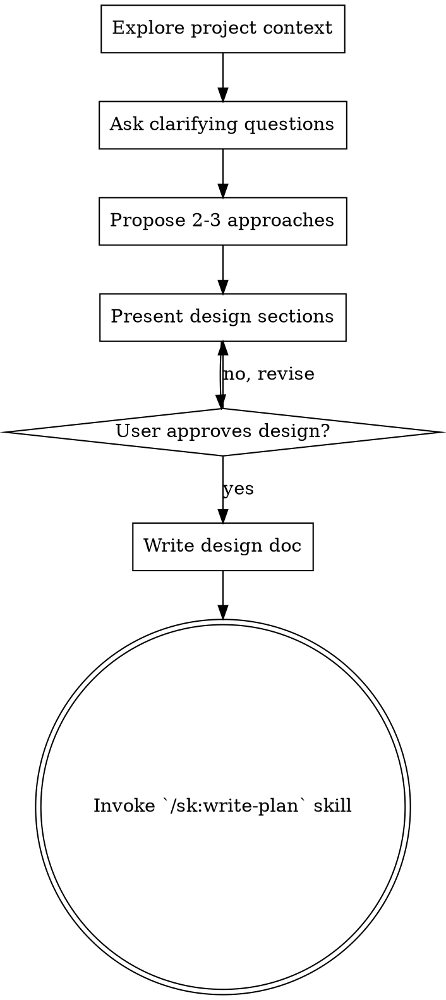

# Brainstorming Ideas Into Designs

## Overview

Help turn ideas into fully formed designs and specs through natural collaborative dialogue.

Start by understanding the current project context, then ask questions one at a time to refine the idea. Once you understand what you're building, present the design and get user approval.

<HARD-GATE>
Do NOT invoke any implementation skill, write any code, scaffold any project, or take any implementation action until you have presented a design and the user has approved it. This applies to EVERY project regardless of perceived simplicity.
</HARD-GATE>

## Anti-Pattern: "This Is Too Simple To Need A Design"

Every project goes through this process. A todo list, a single-function utility, a config change — all of them. "Simple" projects are where unexamined assumptions cause the most wasted work. The design can be short (a few sentences for truly simple projects), but you MUST present it and get approval.

## Checklist

You MUST create a task for each of these items and complete them in order:

1. **Explore project context** — read `tasks/findings.md` and `tasks/lessons.md` if they exist, then check files, docs, recent commits
2. **Ask clarifying questions** — one at a time, understand purpose/constraints/success criteria
3. **Propose 2-3 approaches** — with trade-offs and your recommendation
4. **Present design** — in sections scaled to their complexity, get user approval after each section
5. **Write findings** — Save the agreed-upon direction to `tasks/findings.md`:
   - Problem statement
   - Key decisions made
   - Chosen approach + rationale
   - Open questions (if any remain)
   Additionally, **append** an ADR entry to `docs/decisions.md` (see "Decisions Log" section below).
   (Optionally also write a full design doc to docs/plans/YYYY-MM-DD-<topic>-design.md)
6. **Transition to implementation** — invoke `/sk:write-plan` skill to create implementation plan

## Process Flow



**The terminal state is invoking `/sk:write-plan`.** Do NOT invoke frontend-design, mcp-builder, or any other implementation skill. The ONLY skill you invoke after brainstorming is `/sk:write-plan`.

## The Process

**Understanding the idea:**
- If `tasks/findings.md` exists and has content, read it in full. Summarize the prior
  decisions to the user and ask: extend, revise, or start fresh? Do not re-explore
  what is already decided unless the user asks.
- If `tasks/lessons.md` exists, read it in full. Apply every active lesson as a design
  constraint throughout the brainstorm — particularly prevention rules when proposing approaches.
- Check out the current project state first (files, docs, recent commits)
- Ask questions one at a time to refine the idea
- Prefer multiple choice questions when possible, but open-ended is fine too
- Only one question per message - if a topic needs more exploration, break it into multiple questions
- Focus on understanding: purpose, constraints, success criteria

**Search-First Research (before proposing approaches):**
Before proposing custom solutions, check if the problem is already solved:
1. **Grep codebase** — does similar functionality already exist in this repo?
2. **Check package registries** — is there a well-maintained package for this? (npm, PyPI, Packagist, crates.io)
3. **Check existing skills** — does a ShipKit skill or MCP server already handle this?

Decision matrix:
- **Adopt** — existing solution covers 90%+ of requirements → use it directly
- **Extend** — existing solution covers 60-90% → extend or wrap it
- **Build custom** — nothing suitable exists → build from scratch (informed by what was found)

If a suitable package or existing solution is found, include it as one of the approaches.

**Exploring approaches:**
- Propose 2-3 different approaches with trade-offs
- Present options conversationally with your recommendation and reasoning
- Lead with your recommended option and explain why

**Presenting the design:**
- Once you believe you understand what you're building, present the design
- Scale each section to its complexity: a few sentences if straightforward, up to 200-300 words if nuanced
- Ask after each section whether it looks right so far
- Cover: architecture, components, data flow, error handling, testing
- Be ready to go back and clarify if something doesn't make sense

## After the Design

**Documentation:**
- Write the findings to `tasks/findings.md` (required — captures problem, decisions, approach, rationale)
- Append an ADR entry to `docs/decisions.md` (required — see "Decisions Log" section below)
- Optionally: Create a full design doc at `docs/plans/YYYY-MM-DD-<topic>-design.md` for complex projects
- Commit the findings, decisions log entry, and any design document to git

**Implementation:**
- Invoke the `/sk:write-plan` skill to create a detailed implementation plan
- Do NOT invoke any other skill. `/sk:write-plan` is the next step.

## Decisions Log

After writing findings to `tasks/findings.md`, also **append** an Architecture Decision Record (ADR) entry to `docs/decisions.md`. This file is **cumulative and append-only** — never overwrite or remove existing entries.

### If `docs/decisions.md` does not exist

Create it with this header before the first entry:

```markdown
# Architecture Decision Records

A cumulative log of key design decisions made across features. Append-only — never overwrite.
```

### ADR Entry Format

Append this template for each brainstorm decision:

```markdown
## [YYYY-MM-DD] [Feature/Task Name]

**Context:** [problem being solved — 1-2 sentences]
**Decision:** [chosen approach — 1 sentence]
**Rationale:** [why this approach over alternatives]
**Consequences:** [trade-offs accepted]
**Status:** accepted
```

### Rules

- **Append-only** — never edit or delete existing entries in `docs/decisions.md`
- **One entry per brainstorm** — each completed brainstorm adds exactly one ADR entry
- **Use absolute dates** — always `YYYY-MM-DD`, never relative dates
- Entries accumulate across features — this is a project-level historical record

## Key Principles

- **One question at a time** - Don't overwhelm with multiple questions
- **Multiple choice preferred** - Easier to answer than open-ended when possible
- **YAGNI ruthlessly** - Remove unnecessary features from all designs
- **Explore alternatives** - Always propose 2-3 approaches before settling
- **Incremental validation** - Present design, get approval before moving on
- **Be flexible** - Go back and clarify when something doesn't make sense

---

## Model Routing

Read `.shipkit/config.json` from the project root if it exists.

- If `model_overrides["sk:brainstorming"]` is set, use that model — it takes precedence.
- Otherwise use the `profile` field. Default: `balanced`.

| Profile | Model |
|---------|-------|
| `full-sail` | opus (inherit) |
| `quality` | opus (inherit) |
| `balanced` | sonnet |
| `budget` | sonnet |

> `opus` = inherit (uses the current session model). When spawning sub-agents via the Agent tool, pass `model: "<resolved-model>"`.
